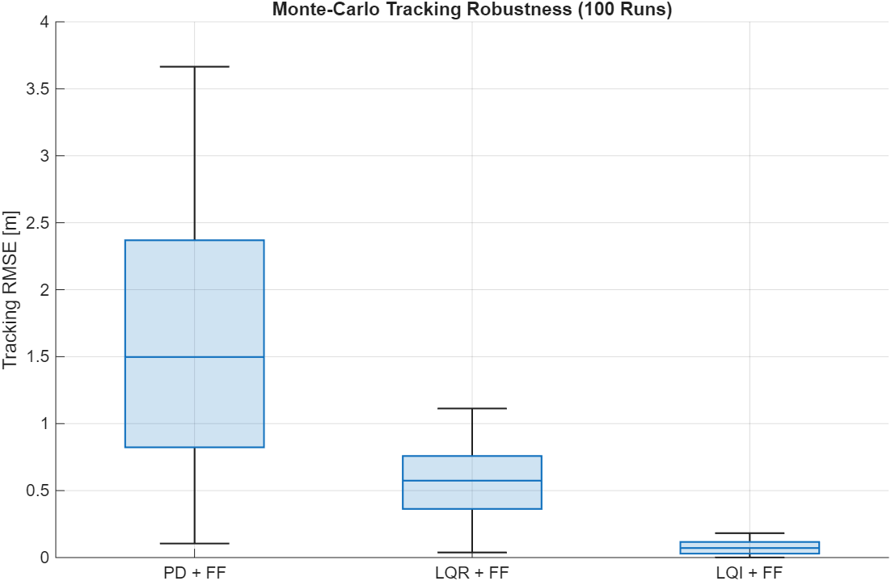
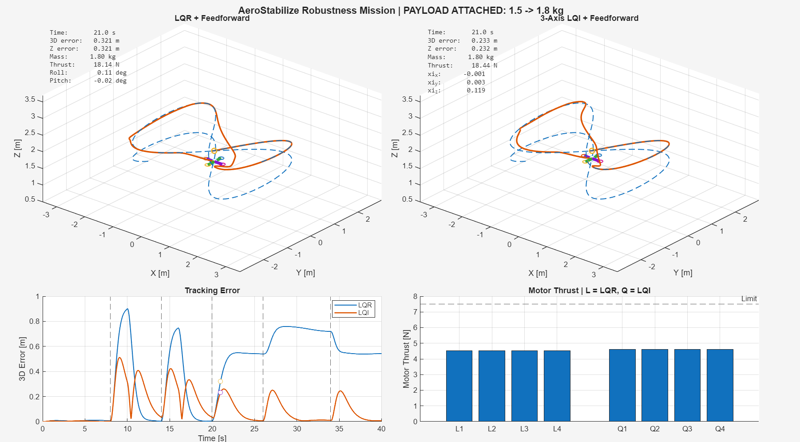

# AeroStabilize

**Nonlinear 6-DOF Quadcopter Flight Control, Trajectory Tracking, and Robustness Analysis in MATLAB**

AeroStabilize is a simulation-based flight-control project for a nonlinear quadcopter model.  
The project explores classical and optimal control strategies, actuator constraints, disturbance rejection, model uncertainty, and statistical robustness.

The complete system is simulated in MATLAB using a nonlinear 12-state rigid-body model and includes controller comparisons between PD, PID, LQR, and LQI architectures.

## Key Features

- Nonlinear 6-DOF quadcopter dynamics
- 12-state rigid-body model
- Cascaded PD position and attitude control
- PID altitude control
- Anti-windup implementation
- Acceleration feedforward
- Motor control allocation and actuator saturation
- LQR full-state feedback control
- LQI with integral action in x, y, and z
- Circular, helical, and Figure-8 trajectories
- Wind disturbance rejection
- Payload and mass uncertainty testing
- LQR vs LQI robustness mission
- 100-run Monte-Carlo robustness analysis
- 3D flight visualization and controller animations

- ## Controller Performance

The project compares classical and optimal control strategies under identical nonlinear plant conditions.

| Test | PD + FF | LQR + FF | LQI + FF |
|---|---:|---:|---:|
| Nominal Helix RMSE | 0.0402 m | 0.0048 m | — |
| Constant Wind RMSE | 0.4926 m | 0.1466 m | — |
| Robustness Mission RMSE | — | 0.4901 m | 0.1705 m |
| Final Robustness Mission Error | — | 0.5423 m | 0.0062 m |

LQR significantly improves trajectory tracking compared with the classical PD controller, while LQI adds integral action to eliminate persistent errors caused by constant disturbances and model mismatch.

## Monte-Carlo Robustness Analysis

A 100-run Monte-Carlo study was performed using randomized plant and disturbance conditions:

- Mass uncertainty: ±20%
- Inertia uncertainty: ±15%
- Horizontal wind magnitude: 0–5 N
- Random wind direction
- Identical randomized conditions for PD, LQR, and LQI

| Metric | PD + FF | LQR + FF | LQI + FF |
|---|---:|---:|---:|
| Mean RMSE | 1.6160 m | 0.5629 m | **0.0764 m** |
| Median RMSE | 1.4974 m | 0.5742 m | **0.0711 m** |
| 95th Percentile RMSE | 3.0669 m | 0.9530 m | **0.1531 m** |
| Worst-Case RMSE | 3.6650 m | 1.1131 m | **0.1822 m** |
| Mean Final Error | 1.6893 m | 0.5778 m | **≈ 0 m** |
| Success Rate | 13% | 40% | **100%** |
| Mean Actuator Saturation | 0% | 0% | 0% |

The LQI controller achieved the best statistical robustness under the tested uncertainty range, with substantially lower tracking error and zero persistent final error in the Monte-Carlo experiment.

### RMSE Distribution

The boxplot below shows the tracking-error distribution across all 100 randomized Monte-Carlo runs.

## Robustness Mission

A final nonlinear Figure-8 mission was used to compare LQR + Feedforward and LQI + Feedforward under multiple disturbances and model uncertainty.

The mission includes:

- Nominal Figure-8 trajectory tracking
- +5 N X-direction gust
- -4 N Y-direction gust
- Payload increase from 1.5 kg to 1.8 kg
- Diagonal crosswind disturbance
- Final disturbance recovery

| Metric | LQR + FF | LQI + FF |
|---|---:|---:|
| Overall Mission RMSE | 0.4901 m | **0.1705 m** |
| Crosswind RMSE | 0.7200 m | **0.1028 m** |
| Final 3D Error | 0.5423 m | **0.0062 m** |

The LQI controller maintains significantly lower tracking error after persistent disturbances and model mismatch because of its integral position-error states.

### LQR vs LQI Mission Visualization

The visualization below shows both controllers during the payload-mismatch phase of the nonlinear Figure-8 mission.

